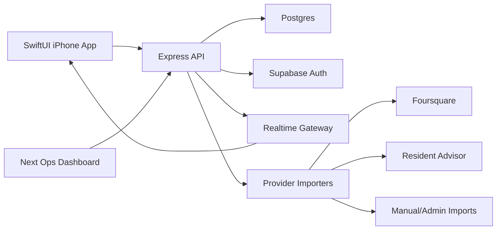

# Nightloop v3 Phase 0 Architecture

Last updated: 2026-04-24

## Purpose

This document is the Phase 0 source of truth for turning the Nightloop v3 design handoff into an App Store-ready native iPhone product. It locks the architecture, scaling assumptions, security posture, and phase gates before any Supabase-dependent backend work begins.

Phase 0 deliberately avoids creating auth tables, Supabase policies, or iOS project files. Phase 1 must start with the Supabase setup gate in `SUPABASE_SETUP_GATE.md`.

## Product Shape

Nightloop is a native iPhone nightlife app with five top-level tabs:

- Home: magazine-style feed with a hero venue, ranked rows, friend strip, live pulse summary, and a compact market picker such as `Tonight in SF v`.
- Map: Mapbox-powered live venue map with Midnight Orchid styling, pulse bloom markers, filter pills with counts, and an anchored venue sheet.
- Decision: group voting session with venue cards, Skip, Details, I'm In, and real-time vote counters.
- Friends: live social activity feed with friend groups, "I'm Coming", invite links, username search, profile QR, and optional contacts matching.
- Profile: Signal Scout progress, user signals, crew, ghost mode, QR, favorites, and Settings entry.

Supporting flows:

- Supabase phone and Sign in with Apple authentication.
- Age attestation after auth.
- Profile setup with display name, username, selected market, and optional bio later.
- Onboarding Variation B with preference screens for vibe, music, crowd, and neighborhoods.
- Venue detail with numeric energy score, pulse label, why lines, trend chart, tags, friends, caveats, directions, share, save, and signal submission.
- Settings for account, privacy, notifications, city/market, map preferences, legal links, support, blocked users, and account deletion.

## Key Product Decisions

- Build a new SwiftUI iPhone app in `ios/Nightloop`.
- Keep the existing Next app and expand it into an ops dashboard, not the consumer app.
- Use Supabase Auth for phone and Apple auth; Express remains the product API.
- Use PostgreSQL as the system of record.
- Use Mapbox Maps SDK for iOS with a custom style URL.
- Ship SF as the first market, but model markets as first-class data.
- Use self-attested 21+ eligibility. If a user does not confirm eligibility, block app access and keep only minimal account state.
- Do not store raw precise user location by default. Use precise location for request-time ranking and map behavior only when the user grants permission.
- Use friends-only presence by default and include ghost mode.
- Use invite links, username search, profile QR, and opt-in hashed contacts matching.
- Include report/block basics and an admin moderation queue.
- Do not include monetization in v1.

## Current Repo Conflicts

The existing repo is a useful prototype foundation, but it is not yet aligned with the product plan:

- There is no native iOS target.
- There is no auth/account/profile/settings model.
- There is no `markets` concept; current seed data and mocks assume San Francisco.
- The frontend map has an `SF_CENTER` constant.
- Resident Advisor ingestion is hard-coded for SF/Oakland.
- Baseline scoring includes single-city/timezone assumptions.
- Current signal API accepts backend-oriented `crowd_report`, `line_report`, and `event_report`; production needs user-facing signal kinds.
- Current scoring and recommendation naming do not fully match the v3 product language.
- Current Next frontend is not the production mobile UX.

Implementation must address these conflicts explicitly instead of layering v3 UI on top of brittle assumptions.

## High-Level Architecture

## Backend Responsibilities

Express owns product business logic:

- Verify Supabase JWTs on protected endpoints.
- Enforce user ownership and friendship/visibility rules.
- Normalize provider data.
- Aggregate venue live state.
- Enforce signal decay and point awards.
- Rate-limit user actions.
- Create moderation and audit events.
- Return app-specific payloads for iOS.

Supabase owns authentication and session identity:

- Phone OTP.
- Sign in with Apple.
- User identity IDs used by the Nightloop profile model.

Postgres owns application data:

- Markets, venues, events, provider records, live states.
- Profiles, preferences, settings, friendships, blocks.
- Signals, reports, activity events, decision sessions, votes.
- Moderation reports and audit logs.

## iOS Responsibilities

The SwiftUI app owns:

- App shell, tab navigation, screen state, and presentation.
- Supabase auth client session.
- API client using bearer tokens.
- View models/load states for each feature.
- Mapbox map rendering and client-side marker/filter presentation.
- Local preference cache for lightweight settings.
- Requesting location, contacts, notification permissions at contextual moments.

The iOS app must never contain service role keys, database credentials, provider secrets, or admin-only endpoints.

## Market Model

A market is a launch city/region. SF is just the first market.

Core market fields:

- `id`
- `slug`
- `display_name`
- `short_label` such as `SF`
- `timezone`
- `country_code`
- `center_latitude`
- `center_longitude`
- `default_zoom`
- `bounds`
- `launch_status`
- `mapbox_style_uri`
- `provider_config`
- `neighborhoods`

User-selected market is stored on profile/settings and appears in the Home title as `Tonight in SF v`. Tapping the control opens a market switcher/menu. The Map tab mirrors active market context without hard-coding city constants.

## Signal System

User-facing signal kinds:

- `packed`
- `short_line`
- `long_line`
- `dead`
- `event_live`

Backend maps these to scoring inputs:

- crowd pressure
- wait/line pressure
- event activity
- recency
- confidence
- user trust/weight

Signals decay on the server. The default decay window is 90 minutes. Clients may display freshness but never decide whether a venue remains active or packed.

Signal Scout points:

- `packed`: +3
- `short_line`: +2
- `long_line`: +2
- `dead`: +2
- `event_live`: +4

## Presence And Privacy

Default presence model:

- Activity is friends-only.
- Ghost mode hides user presence and check-ins from friends.
- Venue-linked signals can still contribute to aggregate live state without exposing identity.
- Precise location is not stored unless tied to explicit venue actions such as check-ins/signals.

Contacts matching:

- Contacts sync is optional and contextual.
- Client normalizes phone numbers and submits hashes for matching.
- Backend returns matched users where allowed.
- Do not persist raw address book contacts.

## Provider Strategy

Phase 2 builds full provider infrastructure, not just SF scripts:

- Provider records are stored with provenance, source IDs, confidence, freshness, and license/attribution data.
- Venue reconciliation handles duplicates across providers and manual corrections.
- Importers are configured per market.
- Initial production connectors are Foursquare, Resident Advisor, and manual/admin imports.
- The design must allow later providers without changing iOS payload shapes.

## Security Baseline

Nightloop uses a backend-mediated architecture for product data. The iOS app talks to Express. Express talks to Postgres/Supabase with server-only credentials where elevated access is required.

Security defaults:

- Supabase RLS on exposed Supabase-managed tables.
- Express authorization on all protected endpoints.
- No service keys in iOS or frontend bundles.
- PII redaction in logs.
- Rate limits for social, signals, contacts, votes, and invites.
- Audit logs for admin/moderation actions.
- Account deletion available in-app.

Supabase references:

- Supabase recommends RLS for exposed schemas and notes that tables without RLS can be accessible through public roles.
- Supabase service/secret keys are elevated and must be handled server-side only.
- Supabase JWTs can be verified via supported libraries or JWKS-based verification.

## App Store Readiness Requirements

Required before App Store submission:

- In-app account deletion.
- Privacy policy, terms, support, delete-account help, and accessibility pages.
- App Privacy details for location, contacts matching, identifiers, diagnostics, user content, third-party SDKs, and push notifications.
- App Review demo/reviewer account with seeded friends, sessions, market data, and review notes.
- Accessibility QA for VoiceOver, dynamic type where feasible, contrast, touch targets, and reduced motion.
- Security hardening phase complete.

## Phase 0 Exit Criteria

Phase 0 is complete when the repo contains:

- This architecture document.
- API contract document.
- data model document.
- security/release checklist.
- phase gate checklist.
- Supabase setup gate document.

Phase 1 must not begin until the user confirms the Supabase project and provides env values locally.
